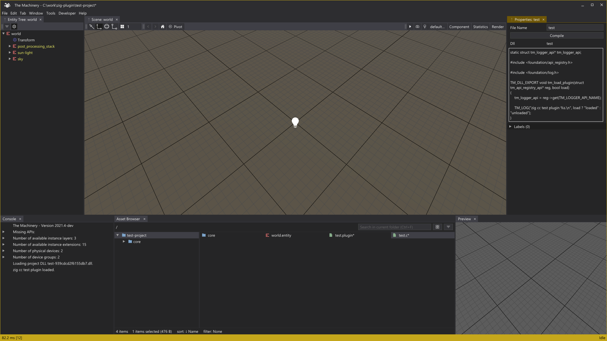

# zig-plugin

This is a hack day project that extends The Machinery with the capability to add `.c` files to a project and compile them to `.dll` assets (using `zig cc` for the compiler).

With this plugin installed, you can do **New C File** in the Asset Browser context menu to create a new C file and then compile that file using the **Compile** button. This creates a new `.dll` asset which is then loaded in the editor.

*In this image, the Properties view shows the content of the test.c asset. The test.plugin asset has been compiled from this source code and is printing its output in the Console.*

**Note**: This plugin depends on APIs that will only be made available in the 2021.4 release.

**Note**: You need to have `zig` installed on your machine in order to be able to compile the `.c` files.

## To Do

* Support compiling `.zig` files in addition to `.c` files.